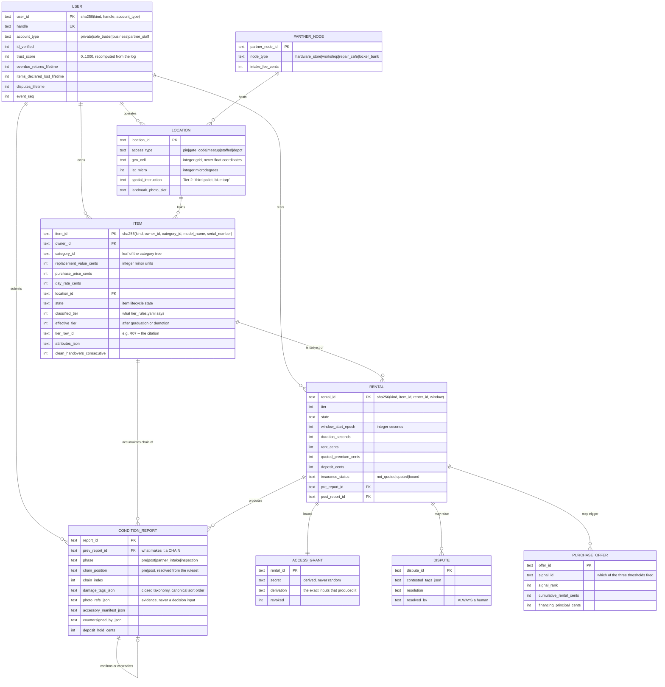
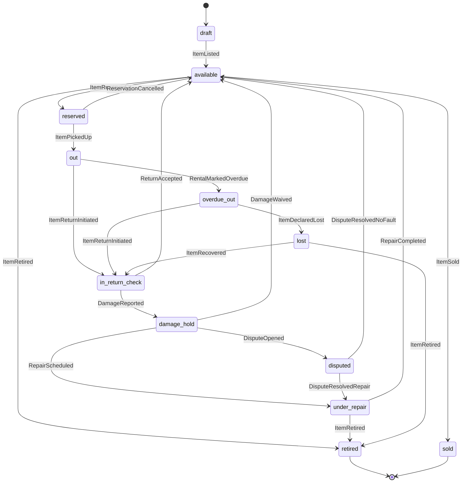
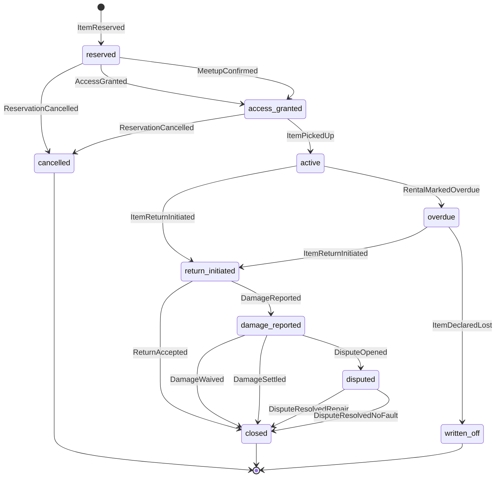

# Architecture

Every design decision this build made, why it went that way, and the open
question it left behind. Where the brief left a question open, the most
interesting workable answer was chosen and implemented — those choices are
marked **[CHOICE]**, and the ones still genuinely undecided are marked **[OPEN]**.

---

## 1. Domain model

### Entities

Full `CREATE TABLE` statements: `rhe/l3_projections/sqlite_store.py`.

### The three questions the brief asked explicitly

**Can an item change location over its lifetime?** **[CHOICE] Yes, and the log is
the record of it.** An item's `location_id` is a projected column, not stored
truth. Moving an item is a new event; the projection reflects the latest one and
the history stays queryable in `event_log`. This falls out of event sourcing for
free — the interesting consequence is that an item moving from a lockbox to a
partner node *changes its tier*, because `partner_node_available` is a classifier
attribute. Custody is a property of the arrangement, not of the object.

**Can a handover involve more than two parties?** **[CHOICE] Yes — three of the
five tiers require it.** Tier 4 has owner, renter, depot staff and a separately
identified certified *operator* who need not be the renter. Tier 5 has owner,
renter and partner staff, with the partner holding custody throughout. The model
does not hardcode "two parties": a condition report names its `submitted_by`
independently of the rental's renter, and `countersigned_by` is a list. That is
why `depot_kai` can submit reports on a rental he is not party to.

**How is ownership history tracked when an item is sold?** **[CHOICE] The chain of
`ItemSold` events IS the provenance record.** The projection's `owner_id` column
is overwritten on sale, but that column is a cache. Replaying the log reconstructs
every owner the item ever had, in order, with the price and the credited rent at
each transfer. Deliberately *not* a mutable `previous_owner` column: that would be
one place for provenance to be lost, and there is now no such place.

### Identity

**[CHOICE] Every id is a content hash over a declared, ordered field set**
(`rhe/l1_kernel/ids.py`), rendered as `usr_2b8e1d877f65`. Same content, same id,
on any machine, forever. Two entities agreeing on every canonical field *are* the
same entity by definition — which is why re-running the seed loader is idempotent
without any "does this exist yet" bookkeeping.

**[OPEN]** Content-hash ids mean a typo in an owner's serial number produces a
genuinely different item rather than an edit. Correcting one needs a compensating
event plus a re-list. That is defensible for an audit trail and annoying for a
user; a production system probably wants a stable surrogate id *alongside* the
content hash.

---

## 2. The tier classifier

**[CHOICE] A YAML decision table with unique integer precedence, and a thin
evaluator.** Ten rule rows, eight attributes, 1152 cells in the cross-product.
The evaluator (`rhe/l1_kernel/classify.py`) is about forty lines and contains no
thresholds, no item knowledge and no default case.

**Totality without a catch-all.** The brief demanded no default case and no silent
`else`. Rows R09 (`enclosable: false`) and R10 (`enclosable: true` +
`weight_class` in hand/two_person) between them partition the input space, with
R08 taking `machine_lift` above them. That is *why* the table is total, and
`tools/prove_exhaustiveness.py` proves it by enumeration rather than by argument.

**Overlaps are real and that is fine.** 1122 of 1152 cells match more than one
row — a licensed, delicate, high-value machine matches four. What the charter
forbids is *ambiguity*, not overlap, so the proof asserts something stronger and
more useful: precedence values are unique, so the winner is never decided by file
order, and every row wins at least one cell (no dead rows lying in a file an
underwriter will read).

**[CHOICE] `requires_license` outranks everything.** Precedence 10. A regulatory
duty cannot be traded against convenience, and it is the one attribute an owner
may never override (`overrides_never_allowed` in `category_tree.yaml`).

**[CHOICE] `partner_node_available` sits second, at precedence 20.** Consigning an
item to a partner is an owner's decision about *custody*, and custody outranks
every physical property of the object. This is what makes the same carpet cleaner
Tier 1 in a lockbox and Tier 5 at a counter — the clearest demonstration that
tiers describe mechanisms, not things.

**The ambiguous cases and how they were settled** (all recorded with reasoning in
`sim/seed/item_bench.yaml`, rendered to `artifacts/item_bench.txt`):

- **Sewing machine → Tier 3.** Boxable and hand-carried, so it *looks* like Tier
  1. Fragility is the only attribute that moves it — and it graduates once proven.
- **Kayak → Tier 2.** Not fragile, not licensed, not valuable enough for Tier 3.
  It is simply too big for a box. A pleasingly boring answer.
- **Chainsaw → Tier 1.** Dangerous, but danger is not a handover attribute. No
  licence is required in DE for private use, so it automates. **[OPEN]** a
  `requires_briefing` attribute distinct from `requires_license` is probably the
  right eventual answer here, sitting between Tiers 1 and 4.
- **Scaffolding and party tent → Tier 2, not 3.** Six detachable parts would
  trigger R06, but R06 explicitly excludes fixed-location items: a parts count you
  verify in place against a marked bay is a Tier 2 checklist, not a reason to make
  two people drive somewhere.
- **Camping gear set → Tier 1.** Many parts, but R06 requires mid-or-higher value.
  A tent bag with fifteen pegs should not force a meetup.
- **Mini excavator → Tier 4.** Small enough that people assume it automates.
  Instruction and inspection duties are regulatory, so it cannot.
- **Trailer and e-bike → Tier 3.** Both would read as Tier 2 on physics alone;
  high value *plus* detachable parts (R05, precedence 50) outranks that.
- **Projector → Tier 1 while a DSLR is Tier 3.** Both sit under the optics root; a
  sealed LED projector is `robust` and a camera with three detachable lenses is
  not. The category tree carries the distinction, not the classifier.

**[OPEN]** `value_band` currently comes from the category, not from the item's own
`replacement_value_cents`. A gold-plated drill classifies as low value. The fix is
to derive `value_band` from the item's declared value at listing time, which also
makes it owner-overridable in a way that is checkable against the insurance bands.

---

## 3. Lifecycle state machines

Two declarative machines in `state_transitions.yaml`: `item` (12 states, 21
transitions) and `rental` (11 states, 17 transitions). Diagrams:

**[CHOICE] Guards are named in data, implemented in code.** The ruleset says
`guards: [pre_condition_report_exists]`; `rhe/l1_kernel/guards.py` says what that
means. Adding a guard to a transition is a data edit; changing what a guard *does*
is a code change with a review. A ruleset file can therefore never introduce new
behaviour, only recombine behaviour that already exists — which also means a YAML
file is never an code-execution surface (there is no `eval` anywhere).

**[CHOICE] Both machines are checked before either is advanced.** `Engine._check`
evaluates the item machine and the rental machine and only then appends. A
half-applied transition can never reach the log.

**Renter never returns the item.** `active → overdue → written_off`, with
`ItemDeclaredLost` also moving the item to `lost`. Two grace periods from the
ruleset gate it: `overdue_grace_seconds: 3600` and `lost_grace_seconds: 604800`.
**Nothing fires on a timer.** Overdue is a command someone issues, gated on the
injected clock — which is exactly why eight days of silence replay in a
millisecond. Scenario `04_overdue_lost` shows both guards refusing before allowing.

**Two consecutive condition reports disagree.** `diff_condition` flags tags
present in report N and absent in N-1 (`appeared`), and the reverse
(`disappeared` — a tag someone logged that has since vanished without a repair).
**The system never adjudicates.** It records both claims, opens a dispute, and
routes it to a person; the closing transition is guarded on
`human_resolution_recorded`, so a dispute *physically cannot* close without a
human id attached. `precedence.yaml:condition_disagreement` decides only which
claim the resolver reads first — countersigned beats uncountersigned, evidence
beats no evidence, older beats newer — and never who is at fault. Scenario
`03_damage_dispute` walks it.

**[OPEN]** There is no `ItemMoved` command yet, so an item cannot change location
without being re-listed. The event vocabulary and the projection support it; the
command layer does not expose it.

---

## 4. Condition chain and trust

**[CHOICE] Photos are evidence, never input.** 26 tags across 9 components and 4
severity levels. A finding that cannot be expressed has exactly one escape hatch,
`other_requires_human`, which always routes out of the automated path. Photos are
stored content-addressed and referenced by slot; nothing in the system reads one.

**[CHOICE] The diff is order-independent by construction.** Reports carry tag
*sets*; every output collection sorts by `(component_id, tag_id)` from
`precedence.yaml`. Comparing A to B gives the same answer regardless of insertion
order, dict iteration order, or machine.

**[CHOICE] Trust reacts to signals, not to raw events.** The command layer
translates a domain event into `TrustSignalRecorded` events naming a signal from
`trust_weights.yaml` plus the event that caused it. Two benefits: `compute_trust`
stays a genuine two-line fold, and every point a score ever moved is a row in the
log *with a cause attached* — which is what the trust ledger in the CLI renders.

**[CHOICE] Trust is recomputed from zero on every read, and clamped after every
signal.** Deliberately wasteful. A score that is only ever derived cannot silently
diverge from its log; an incrementally-mutated counter eventually always does.
Clamping per-step (not once at the end) is what makes signal order significant,
which is why the fold sorts by `event_seq` and nothing else.

**[CHOICE] A baseline report does not penalise the item.** The first entry in a
chain establishes what the item looked like on day one. Counting that as "new
damage" would start every listing in the hole.

**[CHOICE] Graduation thresholds are tuned against each other on purpose.** An
item earns +50 per clean handover (one closure plus two chain entries), so the
four clean handovers the Tier 3 → Tier 1 rule demands land it on exactly the 700
item trust the same rule demands. Graduation should be reachable by doing the
thing well four times, and reachable no other way. A graduation may also never
violate physics: a non-enclosable item can never take the path to Tier 1, and
gets a Tier 3 → Tier 2 path instead.

**[OPEN]** Demotion is specified in the ruleset (`on_new_blocking_damage`,
`on_dispute_resolved_against_owner`) and the `TierDemoted` event exists with a
reducer, but no command emits it yet. A graduated item that later takes blocking
damage keeps its Tier 1 status until someone re-lists it.

**[OPEN]** The condition chain is per-item and strictly linear. Two rentals of the
same item cannot overlap in the model, which is correct for a physical object but
means the chain cannot represent an item split into separately-rentable parts (a
scaffold tower rented as two half-towers).

---

## 5. Access and location

**[CHOICE] One `Location` schema with an `access_type` discriminator** covering
lockboxes (`pin`), yards (`gate_code`), meetup points (`meetup`), depots
(`staffed`) and partner counters (`depot`). The credential shape per type lives in
`ACCESS_TYPES` in `rhe/l1_kernel/access.py`. A meetup issues an empty secret,
because there the counterparty *is* the credential — and the guard context knows
this, which is the one place the abstraction needed an explicit seam.

**[CHOICE] PINs are derived, not generated.**
`sha256(rental_id, location_id, valid_from_epoch)` → six decimal digits. Same
inputs, same PIN, forever. This is not a shortcut around real hardware — it is the
same property igloohome locks rely on to validate offline at the door, and it is
what lets a whole rental replay bit for bit.

**[CHOICE] The access log is ordered by `event_seq`, never by timestamp.** Two
door events in the same second are entirely ordinary. `precedence.yaml` records
this as a sort key so it is a rule rather than a habit.

**[CHOICE] Spatial instructions are content-addressed.** "Through the green gate,
third pallet on the left, under the blue tarp" hashes to a stable
`spatial_instruction_id`. The renter photographs the landmark and *declares*
whether it matched; the declaration is the logged fact and the photo is the
evidence behind it if the declaration is ever challenged. `VerifySpatialLandmark`
with `match_declared: false` halts the load-out and records the mismatch —
scenario `07_tier2_yard` exercises the happy path.

**[OPEN]** Geo cells are a coarse integer grid (`lat_micro // 1000`), enough for a
deterministic distance *band* but not for real proximity search. The search sort
key in `precedence.yaml` names `distance_band` first; nothing computes it yet.

---

## 6. Value layer

**[CHOICE] A 320-cell rate table, generated at build time and committed.**
`(value_band, tier, trust_band, duration_band) → premium_cents`. The generator
(`tools/gen_insurance_rates.py`) does integer arithmetic with basis-of-100
multipliers and quantises to 25-cent steps; the *runtime* does a dict lookup and
nothing else. A key miss raises `RateNotFound` rather than interpolating. The
charter forbids formulas in the runtime decision path, not in the workshop that
produces the table — and a test regenerates the table and asserts it is byte
identical, so the two can never drift.

**[CHOICE] Coverage tier is assigned by handover tier, and higher-touch handovers
earn a *lower* deductible.** Tier 3 gets `full` cover at a 2500-cent deductible
because a countersigned joint inspection is genuinely better evidence than a
lockbox photo. That is the condition chain paying for itself, expressed as money.

**[CHOICE] Three upsell signals, all integer comparisons, ranked by
`precedence.yaml`.** Cumulative spend past 60% of the purchase price
(`cumulative_rental_cents >= price * 6000 // 10000`, division last), three repeat
rentals of the same item, and both halves of a declared complementary pair. 28
pairs are declared with a human-written note each. When several fire, rank decides
the headline; all of them are still recorded.

**[CHOICE] Rent already paid is credited against the purchase price.** That is the
pitch, and it is why the upsell is not merely an ad. `financing_principal_cents =
price - min(cumulative_rent, price)`, split by integer floor division across
3/6/12 months. A renter below trust 600 gets the opportunity recorded but no
financing offer, with `blocked_reason` naming the threshold.

**[OPEN]** Instalments use floor division and let the remainder ride on the final
payment, which is a partner concern in reality. There is also no interest or fee
model — Mondu prices it; we only shape the request.

**[OPEN]** The upsell engine only considers rentals by the *same renter*. An
owner-side signal ("three different renters keep taking this, buy a second one")
is implied by the concept and not built.

---

## 7. The simulator

**[CHOICE] Scenarios are committed data files, not test code.** Each declares a
seed world, a `FixedClock` start time, and an ordered script of commands with
`@ref` bindings resolved to content-hash ids at load. Nine scenarios cover all
five tiers plus the awkward cases. Output goes to a golden file and is
byte-compared on every test run.

**[CHOICE] Every scenario run proves the projection is disposable.** The runner
ends by folding the log independently and comparing SQLite fingerprints — so the
replay guarantee is not a separate test you might forget to run, it is a thing
that has to hold nine times before `make test` can pass.

**[CHOICE] `expect_rejection` steps are first-class.** A scenario can assert that
a command *is refused*, and the refusal renders with the guard that refused it.
That is how `04_overdue_lost` demonstrates both grace periods and how
`08_tier4_certified` demonstrates a certification shortfall.

**[CHOICE] No colour, no timing, no run ids in the output.** A terminal setting
must never change the bytes. Enforced by a test.

**[OPEN]** All nine scenarios share one seed world, which is good for
comparability and means no scenario can demonstrate a cold-start edge case.

---

## 8. Proposed extensions the concept implies

Built and documented, beyond the brief's explicit list:

- **Risk flags as first-class refusals.** Six boolean rules with `block` /
  `review` severities. A blocked reservation still writes its flags to the log,
  because a refusal is a fact worth keeping (`09_risk_refusal`).
- **`chain_position` as a ruleset concept.** Report *phases* are tier-specific
  (`partner_intake`, `inspection`), but the guards only care whether a report sits
  before or after use. Declaring the mapping in `damage_taxonomy.yaml` keeps a
  tuple of phase names out of a projection reducer.
- **A charter test that parses the source.** `tests/test_charter.py` walks the AST
  and fails the build on a banned import, a clock read outside the adapter, a
  float literal or `/` in the pure kernel, an upward import from L1, or an ANSI
  escape in rendered output. A rule that only lives in a document erodes.
- **Dead-row detection in the exhaustiveness proof.** A rule row that never wins a
  cell is either shadowed or wrong, and either way it is a lie in a file an
  underwriter will read.
- **The decision citation as a first-class type.** `Ruleset.citation()` produces
  `tier_rules.yaml v3 row R07 (ruleset fce31abe)` and every decision object
  carries one.

Not built, but the concept clearly wants them:

- **Owner-side inventory analytics** — utilisation per item, idle capital, the
  "buy a second one" signal.
- **Distance-banded search** — the sort key is declared, nothing computes it.
- **Tier demotion on damage** — specified in the ruleset, no command emits it.
- **A ruleset migration story.** Old decisions stay reproducible against their
  original ruleset hash, but nothing yet *fetches* an old ruleset by hash to
  re-derive a historical decision. The hash is stamped; the archive is not built.
